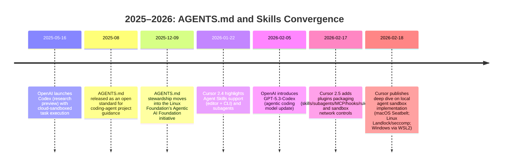

# AGENTS.md and SKILL.md Behavior in Codex, Cursor, and Claude Code (2025–2026)
Research performed on April 5 2026

## Executive summary

AGENTS.md (released August 2025) is explicitly positioned as an open, vendor-neutral “README for agents” meant to provide predictable, project-specific guidance across coding agents. citeturn17search3turn17search5turn17search15

On the narrow question you asked—**“Will all three read `AGENTS.md` in the project root?”**—the answer is **mixed** in a way that is operationally workable:

- **Codex:** **Yes**. Codex explicitly reads `AGENTS.md` (and supports per-directory overrides) **before doing any work**. citeturn21view0  
- **Cursor:** **Yes** (with caveats). Cursor staff describe a root `AGENTS.md` as “read automatically” and treated as an always-on rule; Cursor’s rule docs also describe `AGENTS.md` as a supported alternative to `.cursor/rules` for straightforward instructions. citeturn4view0turn17search1turn17search18  
- **Claude Code:** **Not natively**. Claude Code reads `CLAUDE.md`, **not** `AGENTS.md`. But Claude Code supports importing files at session start, and its docs recommend a minimal `CLAUDE.md` that imports `@AGENTS.md` so both tools share one instruction source. citeturn13view0  

For “skills,” all three systems are converging on the **Agent Skills** progressive-disclosure architecture: at startup, agents load a small routing layer (primarily *name + description*), then lazily load full skill instructions and resources only when invoked/needed. This is stated directly in the Agent Skills standard and echoed in Codex and Claude Code docs; Cursor community + staff reports also describe metadata being present in context and skill bodies loading on demand. citeturn10view0turn10view1turn19view1turn5view2turn18view0  

## Verification of root AGENTS.md support

Codex’s behavior is the most crisply specified, Cursor’s is broadly confirmed (but with ecosystem-specific edge cases), and Claude Code’s is explicitly **“no, but you can import it.”**

**Codex**

Codex states that it reads `AGENTS.md` “before doing any work,” and that it builds an instruction chain at startup by combining a global file (e.g., `~/.codex/AGENTS.md` unless overridden) with project files found along the path from repo root down to the current working directory; nearer files appear later and therefore override earlier guidance. citeturn21view0turn21view3  

**Cursor**

Cursor staff responses (including for automation triggers) report that `AGENTS.md` at the repo root is read automatically and treated as always-on guidance. citeturn4view0turn17search18  
Cursor community discussions and doc excerpts also characterize `AGENTS.md` as “plain markdown without metadata” and a simple alternative to structured project rules. citeturn4view1turn17search1  

Practical caveats that matter for “verification”:
- A Cursor community bug report describes a case where a root-level `AGENTS.md` appeared to “leak” across repositories in a multi-root workspace, and staff indicated it should be scoped to the current repository root (with nested `AGENTS.md` behaving more predictably). citeturn4view1  
- Another Cursor report (late 2025) claimed “background agents” did not load `AGENTS.md`/rules in some scenarios; this contrasts with 2026 staff statements that cloud/automation agents clone repos and load both `.cursor/rules` and root `AGENTS.md`. The most defensible conclusion is: **the intention is “yes,” but older or specific execution surfaces may have had regressions.** citeturn4view2turn17search18turn15search22  

**Claude Code**

Claude Code documentation is unambiguous: it reads `CLAUDE.md`, not `AGENTS.md`. It explicitly recommends importing `AGENTS.md` via `@AGENTS.md` in `CLAUDE.md` so you can keep a single instruction corpus. Claude loads the imported file at session start. citeturn13view0  

## Comparison table

The table below is grounded in the systems’ official docs where available (Codex + Claude Code) and in Cursor’s changelog + staff forum statements for behaviors that Cursor’s public docs describe but are less consistently accessible in static form. citeturn21view0turn19view1turn12view0turn13view0turn5view2turn14view0turn8view0turn16view0turn18view1turn4view0turn17search1turn17search18  

| Dimension | Codex | Cursor | Claude Code (baseline) |
|---|---|---|
| Root “project instructions” file loaded at chat/session start | **AGENTS.md / AGENTS.override.md** (plus configurable fallback names) discovered per-directory, concatenated root→CWD, capped by `project_doc_max_bytes`. citeturn21view0turn21view4 | **AGENTS.md** described by staff as auto-read and always-on; also coexists with `.cursor/rules`. citeturn4view0turn17search1turn17search18 | **CLAUDE.md** is loaded at start; **not** AGENTS.md unless imported (`@AGENTS.md`). citeturn13view0 |
| Skill format | Agent Skills standard (`SKILL.md` + optional resources); Codex adds optional `agents/openai.yaml`. citeturn19view1turn10view1 | Agent Skills standard (`SKILL.md`), plus Cursor packaging via plugins/marketplace. citeturn8view0turn16view6turn10view1 | Agent Skills standard (`SKILL.md`), with substantial extensions in frontmatter (invocation/tool controls, subagent execution, hooks, etc.). citeturn5view2turn10view1 |
| Skill metadata preloaded at startup | Codex: starts with metadata (name, description, file path, plus optional metadata from `agents/openai.yaml`), loads full body only when used. citeturn19view1 | Cursor: staff/user reports show skill metadata (incl. name/description/path/version) showing in context; duplicates can waste context if multiple copies exist. citeturn18view0turn18view1 | Claude Code: “skill descriptions are loaded into context… full skill loads when invoked” (unless model invocation disabled). citeturn5view2 |
| Invocation modes | Explicit (`$skill` or `/skills`) and implicit (description match). Optional `allow_implicit_invocation` in `agents/openai.yaml`. citeturn19view1 | Explicit (`/skill-name`) and implicit (description match); supports `disable-model-invocation` semantics (with known UI bugs around it). citeturn8view3turn20search1turn20search0 | Explicit (`/skill-name`) and implicit (description match), with fine controls (`disable-model-invocation`, `user-invocable`, etc.). citeturn5view2 |
| Skill discovery locations | Repo: `.agents/skills` from CWD up to repo root; user: `$HOME/.agents/skills`; admin/system locations; symlinks supported. citeturn19view1 | Mixed: `.cursor/skills` and `~/.cursor/skills` used; agent context also loads from `~/.agents/skills` but some UIs historically scanned only `.cursor/skills` for slash menus (being fixed iteratively). citeturn18view1turn18view0turn8view3 | Project/global skill sources under `.claude/skills` and `~/.claude/skills`, with nested discovery for monorepos and live change detection for certain sources. citeturn5view4turn5view2turn13view1 |
| Execution safety model | OS sandbox locally + approvals; cloud runs in isolated containers with 2-phase runtime; default network off; protected paths include `.agents`/`.codex`. citeturn12view0 | Local agent sandboxing (Seatbelt on macOS; Landlock/seccomp on Linux; WSL2-based on Windows), plus allowlists + network controls; plugins bundle agent resources. citeturn16view0turn16view6 | Permission modes ranging from read-only to “auto,” with classifier-based checks; protected paths include `.git` and most of `.claude`. citeturn14view0turn13view0 |
| Persistence / memory interaction | Instruction chain rebuilt each run/session; guidance capped by byte limit; auditing via logs is documented. citeturn21view4turn21view0 | Cloud agents: re-indexing on every start described as “by design” due to isolated environments; local indexing and skill scans occur at startup. citeturn15search22turn18view0 | Each session starts with fresh context; persistence via `CLAUDE.md` plus auto memory; explicit tools (`/memory`, `/context`) to inspect what loaded. citeturn13view0turn13view1 |

## Codex analysis

Codex’s “skills + instructions” system is unusually explicit about **what gets loaded when**, and the design is clearly aligned with reducing context bloat via progressive disclosure.

**Skill model and metadata**

Codex skills are directories centered on `SKILL.md` (required `name` + `description`), plus optional scripts/resources. Codex explicitly says it uses progressive disclosure: it starts with skill metadata (name, description, file path, plus optional metadata from `agents/openai.yaml`) and loads the full `SKILL.md` body only when the skill is selected. citeturn19view1turn10view1  

Codex’s `agents/openai.yaml` is a notable “Codex-specific” layer: it can define UI-facing presentation (`display_name`, icons, default prompt), invocation policy (`allow_implicit_invocation: false`), and declared tool dependencies (e.g., MCP server definitions), which effectively functions like a *skill manifest extension* beyond the baseline Agent Skills frontmatter. citeturn19view1  

**Indexing and preload at session start**

For **instructions**, Codex builds an “instruction chain” at startup once per run/session; it reads a global `AGENTS.override.md` or `AGENTS.md` first (first non-empty), then walks the project path from repo root down to the working directory, taking at most one file per directory (override > base > fallback names). It stops adding files when the combined size hits `project_doc_max_bytes` (32 KiB by default). citeturn21view0turn21view4  

For **skills**, Codex scans `.agents/skills` directories from the current working directory up to repo root, plus user/admin/system locations. It does not merge duplicate names; duplicates can appear in selectors. citeturn19view1  

**Invocation and runtime**

Codex supports explicit invocation (CLI/IDE: `/skills` or `$`-mention) and implicit invocation when the user’s task matches the skill description; it emphasizes that implicit matching depends heavily on the description’s scope. citeturn19view1  

**Security and sandboxing**

Codex documents a two-layer model: sandbox mode (technical capability boundaries) + approval policy (when it must ask). Default behavior is network access off; locally it uses OS-enforced sandboxing limited to the workspace plus approvals. For cloud runs, Codex describes isolated containers and a two-phase runtime (setup with network allowed for installs, then offline agent phase by default); secrets exist only during setup and are removed before the agent phase. citeturn12view0  

Codex also documents protected paths inside writable roots, including `.agents` and `.codex` directories being read-only. This is directly relevant if you plan to generate or modify skills/instructions dynamically inside a run. citeturn12view0  

## Cursor analysis

Cursor’s “skill system” and “rule system” coexist, with an additional practical layer: Cursor actively interoperates with artifacts from other ecosystems (including scanning multiple skill locations), which can improve portability but also create duplication and context waste.

**Skill model and metadata**

Cursor added Agent Skills support broadly around the Cursor 2.4 timeframe (Jan 2026 changelog describing skills, subagents, and context management). citeturn8view0turn8view4  
The Agent Skills format itself specifies progressive disclosure: name/description loaded at startup, full instructions loaded on activation, then resources as needed. citeturn10view0turn10view1  

Cursor-specific nuance: a Cursor bug report (and staff confirmation) indicates that Cursor may load skill metadata including **name, version, description, and full path** into the context window, and duplicates can multiply that cost when skills are installed in multiple tool directories. citeturn18view0  

Cursor also supports `disable-model-invocation` semantics in skill frontmatter (prevent implicit loading; keep manual invocation), but forum reports indicate release-to-release UX bugs where that flag can unintentionally hide skills from the slash palette, especially for plugin-delivered skills. citeturn20search1turn20search0  

**Indexing and preload at chat start**

Two distinct “startup” behaviors matter in Cursor:

- **AGENTS.md preload:** Cursor staff describe a root `AGENTS.md` as auto-read, always-on. citeturn4view0turn17search18  
- **Skill catalog preload:** Cursor scans skill directories at startup and presents skills to the agent; Cursor CLI historically had inconsistencies between what the agent-context system loads and what the `/` menu shows (e.g., context loads `~/.agents/skills` while the slash menu scanned `.cursor/skills`), with fixes landing iteratively. citeturn18view1turn18view2  

These differences strongly affect practical discoverability: you can have a skill that auto-invokes (agent sees it) but does not appear in interactive UI lists for manual invocation, depending on version and surface. citeturn18view1turn18view2  

**Rules vs AGENTS.md**

Cursor’s ecosystem includes a structured “rules” system plus `AGENTS.md` as a simpler alternative. Cursor community excerpts and staff commentary frame `AGENTS.md` as “plain markdown without metadata,” while project rules have metadata and application modes (e.g., “always apply” vs more selective use). citeturn4view1turn3search15turn17search1  

In practice, Cursor users report treating a root `AGENTS.md` as an always-on instruction layer, while using `.cursor/rules/` to scope more granular “when to apply” behavior. citeturn17search18turn3search15  

**Security: sandboxing and approvals**

Cursor has published detailed design notes on local sandboxing: on macOS it evaluated multiple approaches and selected Seatbelt via `sandbox-exec`, generating policies dynamically; on Linux it uses Landlock + seccomp; on Windows it runs the Linux sandbox inside WSL2 (while working towards native primitives). citeturn16view0  

Cursor’s Feb 2026 changelog also highlights granular sandbox network access controls (domain allowlists, defaults, or unrestricted) and enterprise-enforced egress policies. citeturn16view6  

**Persistence and indexing**

Cursor cloud agents run in isolated environments; a Cursor staff response describes re-indexing on every cloud agent start as “by design” due to that isolation. citeturn15search22turn8view1  
For local skills, Cursor scans the filesystem on startup (and has known limitations around symlink indexing). citeturn18view0turn18view4  

## Claude Code baseline analysis

Claude Code is the clearest “baseline” for the skill metadata preload behavior you heard from Anthropic: it is stated both in the Agent Skills standard and in Claude Code’s own docs.

**Skill model and metadata**

Claude Code skills require `SKILL.md` with YAML frontmatter and instructions; the `name` becomes the slash command and the `description` is used for auto-loading decisions. citeturn5view0turn10view1  

Claude Code extends the baseline format with multiple frontmatter fields that affect invocation, tool access, and execution model—e.g., `disable-model-invocation`, `user-invocable`, `allowed-tools`, optional `context: fork` to run in a subagent, and skill hooks. citeturn5view2turn5view0  

**Indexing/preload behavior at session start**

Claude Code states explicitly that in a regular session **skill descriptions are loaded into context** so the tool knows what’s available, while the **full skill content loads only when invoked**. It even provides a matrix for how `disable-model-invocation` changes whether descriptions are included at startup. citeturn5view2  

This aligns with the Agent Skills standard’s progressive disclosure definition: at startup load only name/description; on activation load full instructions; then load resources on demand. citeturn10view0turn10view1  

**AGENTS.md behavior**

Claude Code documentation is explicit: it reads `CLAUDE.md`, not `AGENTS.md`. If a repo uses `AGENTS.md` for other agents, Claude Code recommends a `CLAUDE.md` that imports `@AGENTS.md` so both tools share the same content. citeturn13view0  

**Security and permissions**

Claude Code’s permission modes range from default read-only behavior through progressively more autonomous modes; it lists protected paths (including `.git` and most of `.claude`) that are never auto-approved. It also describes an “auto mode” where a separate classifier evaluates actions before execution and blocks common escalation patterns. citeturn14view0  

**Persistence and memory**

Claude Code frames sessions as starting with a fresh context window; cross-session continuity comes from `CLAUDE.md` plus auto memory. It provides commands to inspect what loaded (`/context`, `/memory`, `/skills`). citeturn13view0turn13view1  

## Practical recommendations and a 2025–2026 timeline

### Recommendations for using AGENTS.md as your single source of truth

If your goal is **“one root file all agents respect”**, you can achieve it with a small compatibility shim:

1. **Put your canonical instructions in `AGENTS.md` at repo root** (keep it concise; treat it like a runbook for an unfamiliar but competent engineer). This will be read by Codex and Cursor. citeturn21view0turn4view0turn17search18  
2. **Add a repo-root `CLAUDE.md` that contains only `@AGENTS.md` (+ optional Claude-specific deltas)** so Claude Code loads the same instructions at session start. citeturn13view0  
3. For monorepos, **use nested overrides** rather than growing one huge root file:
   - Codex supports directory-specific `AGENTS.override.md` / `AGENTS.md` and merges root→local with a documented size cap. citeturn21view0turn21view4  
   - Claude Code supports directory hierarchy loading (ancestor files loaded at launch; subdirectory files loaded when operating in that subtree), and provides exclude mechanisms for monorepos. citeturn13view0  
   - Cursor behavior is intended to scope `AGENTS.md` to the current repo hierarchy, but there have been multi-root edge cases; test in the specific Cursor surface you care about (IDE vs cloud vs automation). citeturn4view1turn17search18turn15search22  

**Design pattern for AGENTS.md that tends to generalize well across agents**
- Put *commands and invariants* up top: install, build, test, lint, “definition of done,” and explicit “never do X” constraints. Codex and Claude Code both emphasize that these files consume context tokens and should be kept short and structured. citeturn21view4turn13view0  
- Keep it under a few hundred lines. Claude Code explicitly recommends ~200 lines for `CLAUDE.md` (and imports expand into that budget), and Codex has a default 32 KiB cap for combined instruction files. citeturn13view0turn21view0  

### Recommendations for SKILL.md authoring to maximize correct triggering across agents

Because the routing layer is primarily the **description**, treat it as a classifier prompt, not prose:

- Use the Agent Skills progressive disclosure model consciously: keep the `description` rich with user-language triggers; keep the main body of `SKILL.md` action-oriented and compact; move large references into `references/` and link them so they load only when needed. citeturn10view1turn10view2turn5view2  
- Include explicit negative scope (“do not trigger when…”) where high false positives would be costly. Codex explicitly warns implicit matching depends on description boundaries. citeturn19view1  
- Use `disable-model-invocation: true` for workflows with side effects or for rarely-used heavy skills, so they only load when explicitly invoked. This behavior is described in Claude Code’s docs and is referenced in Cursor/Codex ecosystems as well (though Cursor has had UI bugs around it). citeturn5view2turn20search1turn20search0turn19view1  
- Prefer one canonical installation location per surface to avoid duplicate metadata bloat, especially in Cursor where duplicates across tool ecosystems have been observed to multiply the metadata injected into context. citeturn18view0turn18view1  

### Recommendations for Cursor `.cursor/rules` alongside AGENTS.md

If you use Cursor heavily, you’ll usually want both:

- Use **AGENTS.md** for human-readable, tool-agnostic project briefing (the shared “contract” across agents). citeturn17search1turn4view1  
- Use **`.cursor/rules/`** for Cursor-specific scoping, application modes, and agent harness shaping (e.g., rules that apply only to certain globs or situations). Cursor community docs and discussions consistently distinguish “always-on declarative rules” from “agent-decided skills.” citeturn8view0turn8view5turn3search15turn10view1  

### Timeline of major changes (2025–2026)

Milestones below are taken from primary vendor announcements / changelogs and foundation announcements. citeturn17search2turn17search3turn17search10turn8view0turn16view6turn16view0  

